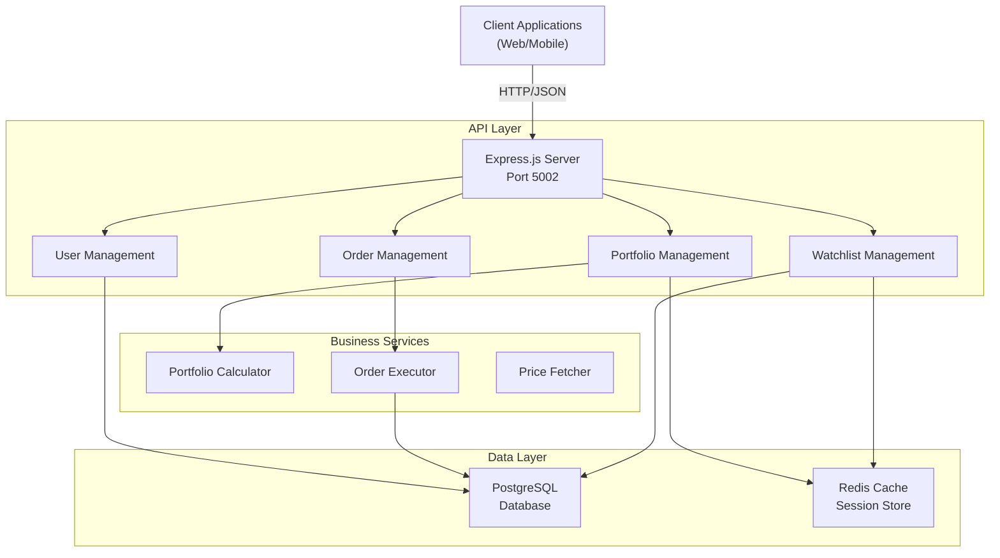
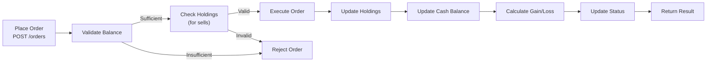

# TradeIn Paper Trading - Architecture

## System Overview

TradeIn Paper Trading is a comprehensive stock trading simulation platform allowing users to practice trading with simulated money using real market data.



## 3-Tier Architecture

### Presentation Tier
- REST API endpoints for web and mobile clients
- Health check monitoring
- Real-time trading operations

### Application Tier
- **User Management**: Account creation, authentication
- **Portfolio Management**: Create and manage trading portfolios
- **Order Management**: Buy/sell order execution
- **Watchlist**: Track favorite stocks
- **Services**:
  - PortfolioCalculator: Calculate portfolio value and gains
  - OrderExecutor: Execute buy/sell orders
  - PriceFetcher: Fetch real-time stock prices

### Data Tier
- **PostgreSQL**: Primary database for persistent data
- **Redis**: Caching for portfolios, watchlists, user sessions

## Database Schema

### Users Table
```sql
users (
  id: SERIAL PRIMARY KEY,
  user_id: VARCHAR(50) UNIQUE,
  username: VARCHAR(100) UNIQUE,
  email: VARCHAR(255) UNIQUE,
  full_name: VARCHAR(255),
  initial_balance: NUMERIC(12,2),
  status: VARCHAR(20) [active/inactive]
)
```
- 10 users with initial balances ranging from 100K to 190K

### Portfolios Table
```sql
portfolios (
  id: SERIAL PRIMARY KEY,
  portfolio_id: VARCHAR(50) UNIQUE,
  user_id: VARCHAR(50) FK,
  portfolio_name: VARCHAR(255),
  cash_balance: NUMERIC(12,2),
  total_value: NUMERIC(12,2),
  daily_gain_loss: NUMERIC(12,2),
  daily_gain_loss_pct: NUMERIC(5,2)
)
```
- 10 portfolios (one per user)
- Tracks cash and total portfolio value

### Orders Table
```sql
orders (
  id: SERIAL PRIMARY KEY,
  order_id: VARCHAR(50) UNIQUE,
  portfolio_id: VARCHAR(50) FK,
  symbol: VARCHAR(10),
  order_type: VARCHAR(20) [market/limit],
  action: VARCHAR(10) [buy/sell],
  quantity: INT,
  price: NUMERIC(10,2),
  status: VARCHAR(20) [pending/executed/cancelled],
  execution_time: TIMESTAMP
)
```
- 50+ sample orders
- Mix of buy/sell, market/limit orders
- Various execution statuses

### Holdings Table
```sql
holdings (
  id: SERIAL PRIMARY KEY,
  portfolio_id: VARCHAR(50) FK,
  symbol: VARCHAR(10),
  quantity: INT,
  avg_cost: NUMERIC(10,2),
  current_price: NUMERIC(10,2),
  current_value: NUMERIC(12,2),
  gain_loss: NUMERIC(12,2),
  gain_loss_pct: NUMERIC(5,2)
)
```
- Current stock positions
- Tracks average cost and current gains/losses
- Multiple holdings per portfolio

### Watchlist Table
```sql
watchlist (
  id: SERIAL PRIMARY KEY,
  watchlist_id: VARCHAR(50) UNIQUE,
  user_id: VARCHAR(50) FK,
  symbol: VARCHAR(10),
  added_date: TIMESTAMP
)
```
- User's tracked stocks
- Unique constraint on (user_id, symbol)

## API Endpoints

### Users
- `POST /api/users` - Create new trader account
- `GET /api/users` - List all users with pagination
- `GET /api/users/:id` - Get user profile (cached in Redis)

### Portfolios
- `POST /api/portfolios/:userId` - Create new trading portfolio
- `GET /api/portfolios/:userId` - List user's portfolios (cached)
- `GET /api/portfolios/:userId/:portfolioId` - Get portfolio with holdings

### Orders
- `POST /api/orders/:portfolioId` - Place new order (buy/sell)
- `GET /api/orders/:portfolioId` - List portfolio orders
- `PATCH /api/orders/:orderId` - Update order (status, price)
- `DELETE /api/orders/:orderId` - Cancel order

### Watchlist
- `POST /api/watchlist/:userId` - Add symbol to watchlist
- `GET /api/watchlist/:userId` - Get watchlist (cached)
- `DELETE /api/watchlist/:userId/:symbol` - Remove from watchlist

### Health
- `GET /health` - API and database health status

## Order Processing Flow



## Technology Stack

- **Runtime**: Node.js 16+
- **Framework**: Express.js 4.18
- **Database**: PostgreSQL 12+
- **Cache**: Redis 6+
- **Validation**: Joi
- **Testing**: Jest, Supertest
- **API Format**: REST JSON

## Caching Strategy

**Redis Caching:**
- User profiles: 1 hour TTL
- Portfolios: 30 minutes TTL
- Watchlists: 1 hour TTL
- Cache invalidation on updates

## Database Indexes

- `portfolios(user_id)`
- `orders(portfolio_id, status)`
- `holdings(portfolio_id)`
- `watchlist(user_id)`
- `price_history(symbol, timestamp DESC)`

## Service Layer

### PortfolioCalculator
- Calculates total portfolio value (cash + holdings)
- Computes daily gains/losses
- Determines percentage gains
- Cache results in Redis

### OrderExecutor
- Validates order (balance, holdings)
- Updates portfolio cash
- Updates/creates holdings
- Calculates gain/loss metrics
- Transactional execution

### PriceFetcher
- Fetches current stock prices
- Updates holdings prices
- Stores price history
- Triggers gain/loss recalculation

## Sample Data

**10 Users:**
- Each with unique username and email
- Initial balance: 100K - 190K
- Status: active

**10 Portfolios:**
- One per user
- Initial cash balance
- Multiple holdings

**Holdings:**
- Mix of 10 popular stocks (AAPL, GOOGL, MSFT, AMZN, TSLA, META, NVDA, JPM, V, JNJ)
- 1-5 holdings per portfolio
- Realistic prices ($50-$300)
- Random quantity (10-100 shares)

**50+ Orders:**
- Mix of buy/sell actions
- Market and limit orders
- Various statuses (pending, executed, cancelled)

**Watchlists:**
- 2-5 symbols per user
- Mix of tracked stocks

## Scalability

1. **Caching**: Redis reduces database load
2. **Connection Pooling**: Efficient database connections
3. **Indexing**: Fast queries on frequently searched fields
4. **Stateless Design**: Horizontal scaling ready
5. **Read Replicas**: Can add for read-heavy operations

## Error Handling

- Validation errors (400)
- Not found errors (404)
- Duplicate entry errors (400)
- Insufficient balance errors (400)
- Insufficient holdings errors (400)
- Server errors (500)
- Database connection errors (503)

## Performance Metrics

- Order execution: < 100ms
- Portfolio calculation: < 50ms
- Cache hit rate: > 70%
- API response time: < 200ms (p95)

## Security Considerations

- Input validation with Joi
- SQL injection prevention (parameterized queries)
- CORS enabled
- Environment variables for secrets
- Password hashing ready
- Rate limiting ready

## Future Enhancements

1. Real-time market data integration
2. Technical analysis indicators
3. Portfolio rebalancing alerts
4. Social trading features
5. Mobile app integration
6. Advanced order types (trailing stops, etc.)
7. Multi-currency support
8. Tax reporting
